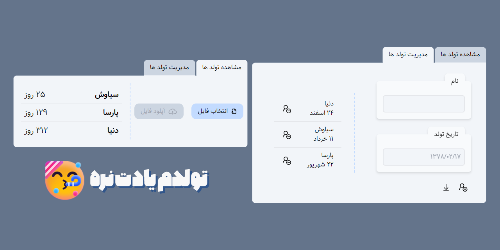

# تولدم یادت نره 🥳
این ابزار برای مدیریت تولد ها ایجاد شده و به شما کمک میکنه که تولد عزیزانتون رو فراموش نکنید. (البته باید یادتون باشه که سایت رو چک کنید وگرنه فراموشتون میشه🤭)
تا یادم نرفته بگم که امکان ساخت لیستی از تولد ها وجود داره و میشه اونو به اشتراک گداشت. برای اشتراک گذاشتن لیست تولد ها فقط کافیه گزینه دانلود رو انتخاب کنید و فایل دانلود شده رو برای اون عزیزی که می‌خواید بفرستید و با بارگذازی فایل لیست تولد به تولد های شما اضافه میشن.

یه نکته دیگه هم اینکه همیشه لیست تولد ها به ترتیب نزدیک بودن به تاریخ تولد مرتب میشن که یه وقت تولد رو از دست ندی.

مشتاقانه منتظر نظرات و پیشنهاداتتون هستم.

[لینک سایت](https://myadegari.github.io/birthday-reminder/)

## ابزار های مورد استفاده برای توسعه این سایت

# Don't miss my Birthday 🥳
Certainly! This tool is designed for **birthday management** and helps you keep track of your loved ones' birthdays so you don't forget them. However, there's a little catch: you need to remember to check the website; otherwise, you might still forget! 🤭

Here are some key features of this birthday management tool:

1. **Create Birthday Lists**: You can create a list of birthdays, making it easy to organize and manage.
2. **Share Birthday Lists**: Want to share the list with someone? No problem! Just select the "Download" option, send the downloaded file to the person you want to share it with, and they can add the birthdays to their own list by uploading the file.
3. **Sorted by Date**: The tool automatically arranges the birthday list in chronological order, ensuring that you never miss an important date.
   
[Website!](https://myadegari.github.io/birthday-reminder/)

Feel free to share your thoughts and suggestions—I'm eagerly waiting! 😊

  

